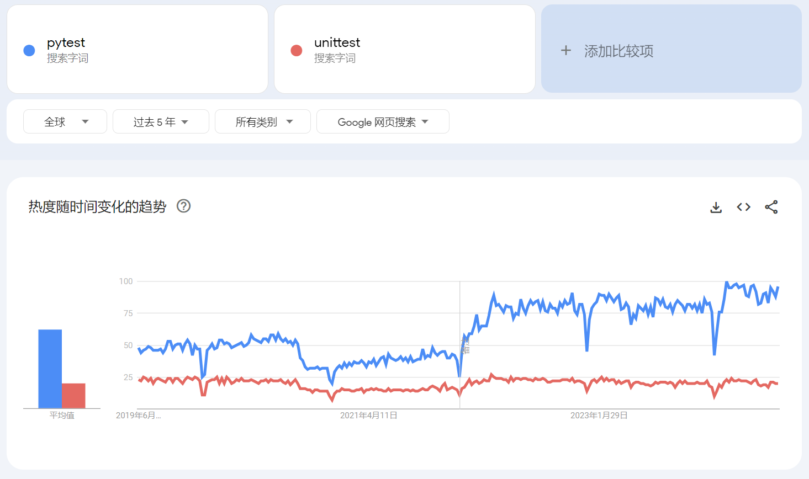

# Learn-pytest-class

## 前言

我们在学习自动化测试的时候，核心就是学习三个技术：

* 编程语言
* 单元测试框架 ⭐︎
* 测试库

`pytest` 是一个 Python 第三方的开源测试框架，因为其简单易用、功能强大，正在变得越来越流行。

本课程将全面的介绍 `pytest`的使用，从`基本使用`、`扩展插件使用`，以及`插件开发` 三个层次介绍。

* google趋势




### pytest发展简史

以下是 `pytest` 单元测试框架的发展历史：

- **2004年**: Holger Krekel（霍尔格·克雷克尔） 创建了 `sdt` 包。`sdt` 最初是一个集合工具和库，旨在帮助开发者更高效地编写测试代码和脚本。`sdt` 包包含了多种实用工具，例如用于文件操作、路径管理、**测试执行** 等功能。这些工具设计上都力求简洁和高效，以提高开发者的生产力。
  其中，`sdt`集成了`py.test`。它最初作为 `sdt` 库的一部分推出，旨在提供比标准库中的 unittest 更为灵活和简单的测试工具。

- **2005年**：为了更好地反映包的用途和功能，Holger Krekel 决定将 `sdt` 包更名为 `py`。更名后的 `py` 包不仅保留了原有的功能，还在此基础上进行了扩展和改进。py 包逐渐成为一个更加全面和成熟的工具集合。

- **2007年**：Holger Krekel 从 py 库中分离出 py.test，作为独立的 `pytest` 项目继续发展。这个分离使得 `pytest` 得以专注于测试功能的增强和优化。

- **2011年**：推出了插件机制，允许用户通过插件扩展 `pytest` 的功能。这一机制使得 `pytest` 成为一个高度可扩展的测试框架。

- **2016年**：发布的 pytest 3.0 版本开始，正式将 `py.test` 命令更名为 `pytest` 。虽然在此之前，`py.test` 一直是推荐的命令行调用方式，但为了统一命名并避免混淆，从 3.0 版本开始，官方建议使用 `pytest` 命令。

- **2019年**：`pytest` 获得了 Python 软件基金会的资助，用于进一步改进和推广该项目。

- **现在**：``pytest``已经变得越来越流行，我们可以在许多Python项目中看到`pytest`的身影。在自动化测试领域也得到了广泛的应用。


### pytest优点

`pytest` 作为 Python的第三方单元测试框架，相较于Python集成的`unittest` 有以下几个主要优点：

1. **更简洁的测试代码**：
   - `pytest` 直接创建测试函数使用，断言方法也可以直接使用 `assert` 语句。这使得测试代码更加直观和简洁。

2. **自动发现测试**：
   - `pytest` 命令能够自动发现符合特定命名模式的测试函数和测试类（通常以 `test_` 开头的函数和 `Test` 开头的类），这使得运行测试也更加简单，直接在测试目录下执行`pytest`命令，可以不用跟任何参数。

3. **conftest.py文件**：
   - `pytest` 提供了 `conftest.py` 文件，是`pytest`中一个强大且灵活的配置工具，用于定义 fixture、自定义 hook 函数、添加命令行选项和共享测试代码。

4. **丰富的插件生态**：
   - `pytest` 拥有强大的插件系统，允许用户轻松地扩展其功能。社区贡献了许多有用的插件，如 `pytest-cov`（用于代码覆盖率）、`pytest-html`（用于生成HTML报告）、`pytest-xdist`（用于分布式执行用例）等，极大地增强了 `pytest` 的适用性。

总结，`pytest` 在简洁性、灵活性和功能性方面表现优秀，这也是为什么 `pytest` 能够在 Python 开发者社区中迅速流行的原因。

## 基本使用

### 安装

最新`pytest 8.2.2`支持Python版本: 

* Python 3.8+ 
* PyPy3

通过pip命令安装。

```shell
$ pip install -U pytest
```

查看`pytest`版本。

```shell
$ pytest --version
pytest 8.2.2
```

### 基本例子

```py
# test_sample.py

def func(x):
    """被测函数"""
    return x + 1


def test_answer():
    """测试函数"""
    assert func(3) == 5


class TestClass:
    """测试类"""

    def test_one(self):
        """测试方法"""
        x = "this"
        assert "h" in x

    def test_two(self):
        x = "hello"
        assert hasattr(x, "check")

```

**代码说明**

1. 我们可以直接创建测试函数，例如`test_answer()`，也可以创建测试类`TestClass` 和测试方法`test_one()`、`test_two()`。

2. 直接使用Python提供的`assert` 语句进行断言，方法用更加简洁，当然，这个有利有弊。


### 运行测试（默认发现）

pytest 运行测试有两种方式：`pytest` 命令 和 `pytest.main()` 方法。

#### pytest命令

在测试目录下使用`pytest`命令，`pytest`命令会自动查找当前目录下的用例。

__直接执行__

```shell
$  pytest
================================= test session starts ===============================
platform win32 -- Python 3.11.9, pytest-8.2.2, pluggy-1.5.0
rootdir: D:\github\AutoTestClass\Learn-pytest-class\demo\base_used\sample
collected 3 items

test_sample.py F.F                                                                                               [100%]

================================= FAILURES ==========================================
__________________________-______ test_answer _______________________________________

    def test_answer():
        """测试函数"""
>       assert func(3) == 5
E       assert 4 == 5
E        +  where 4 = func(3)

test_sample.py:8: AssertionError
_________________________________ TestClass.test_two ________________________________

self = <test_sample.TestClass object at 0x000001E2A0505690>

    def test_two(self):
        x = "hello"
>       assert hasattr(x, "check")
E       AssertionError: assert False
E        +  where False = hasattr('hello', 'check')

test_sample.py:21: AssertionError
============================== short test summary info =============================
FAILED test_sample.py::test_answer - assert 4 == 5
FAILED test_sample.py::TestClass::test_two - AssertionError: assert False
============================ 2 failed, 1 passed in 0.19s ===========================

```

__跟参数执行__

```shell
$ pytest -s

$ pytest -x

$ pytest -v

$ pytest -q

$ pytest --no-header

$ pytest --no-summary

$ pytest --no-header --no-summary  # 多个参数一起用
```

- `-s`：--capture=no 的简写，可以打印`print()`信息。
- `-x`/`--exitfirst`：在第一个错误或失败的测试上立即退出。
- `-v`/ `--verbose`：增加详细输出。
- `-q`/ `--quiet`：减少详细输出。
- `--no-header`：禁用头部信息。
- `--no-summary`：禁用总结信息，不再显示具体的报错。


#### main方法

我们需要创建一个Python文件，使用`pytest.main()`方法执行用例。

```python
# run.py
import pytest

if __name__ == '__main__':
    pytest.main()
```

__执行文件__

```shell
$ python run.py

================================== test session starts =================================
platform win32 -- Python 3.11.9, pytest-8.2.2, pluggy-1.5.0
rootdir: D:\github\AutoTestClass\Learn-pytest-class\demo\base_used\sample
collected 3 items

test_sample.py F.F                                                                                               [100%]

======================================= FAILURES =======================================
______________________________________ test_answer _____________________________________

    def test_answer():
        """测试函数"""
>       assert func(3) == 5
E       assert 4 == 5
E        +  where 4 = func(3)

test_sample.py:8: AssertionError
__________________________________ TestClass.test_two _________________________________

self = <test_sample.TestClass object at 0x0000018FF6507510>

    def test_two(self):
        x = "hello"
>       assert hasattr(x, "check")
E       AssertionError: assert False
E        +  where False = hasattr('hello', 'check')

test_sample.py:22: AssertionError
============================== short test summary info ================================
FAILED test_sample.py::test_answer - assert 4 == 5
FAILED test_sample.py::TestClass::test_two - AssertionError: assert False
============================= 2 failed, 1 passed in 0.08s =============================
```

__使用参数__

在文件中依然可以使用参数。通过list 设置多个参数。

```python
# run.py
import pytest

if __name__ == '__main__':
    # pytest.main(["-s"])
    # pytest.main(["-x"])
    # pytest.main(["-v"])
    # pytest.main(["-q"])
    # pytest.main(["--no-header"])
    # pytest.main(["--no-summary"])
    pytest.main(["--no-header", "--no-summary"])  # 多个参数一起用。
```


### 运行测试（控制粒度）

除了默认`pytest`发现测试用例并执行，更多时候，我们需要控制测试用例的颗粒度，就是说，我们仅仅想执行某个`目录`或`文件`用例，甚至是某个`类`或`方法`。

**目录结构:**

```
└───sample
|   └───test_sample.py
```

#### 用例粒度

以下是单个粒度的执行。

```shell
$ pytest sample   # 目录

$ pytest sample\test_sample.py  # 文件

$ pytest sample\test_sample.py  # 文件

$ pytest sample\test_sample.py::test_answer  # 函数

$ pytest sample\test_sample.py::TestClass  # 类

$ pytest sample\test_sample.py::TestClass::test_one  # 方法
```

#### 多个组合

有时候，我们想同时执行A文件b测试用例 和 B文件的a测试用例。`pytest`允许指定多个用例。

```shell
$ pytest sample\test_sample.py::TestClass::test_one  sample\test_sample.py::TestClass::test_two
```

🔖 `pytest 8.2` 新写法 。

显然，上面的写法有些麻烦，所以，我们可以将其放到一个文件中执行。

```txt
sample/test_sample.py::TestClass::test_one
sample/test_sample.py::TestClass::test_two
```

通过`pytest @file_name.txt`运行测试。

```
$ pytest @tests_to_run.txt
============================= test session starts =============================
platform win32 -- Python 3.11.9, pytest-8.2.2, pluggy-1.5.0
rootdir: D:\github\AutoTestClass\Learn-pytest-class\demo\base_used
collected 2 items / 2 deselected / 0 selected

============================ 2 deselected in 0.01s ============================
```

注明：windows `PowerShell` 不支持。可以使用`git bash`执行。


#### 筛选方法

在一个范围内通过`关键字`筛选，无疑是简单的用法。`pytest -k`参数可以实现。

为了更好的演示，我们先准备一组测试用例。

```py
# test_calculator.py

class Calculator:

    def add(self, a, b):
        return a + b

    def sub(self, a, b):
        return a - b


class TestAdd:

    def test_add_int_1(self):
        cal = Calculator()
        ret = cal.add(1, 2)
        assert ret == 3

    def test_add_str_2(self):
        cal = Calculator()
        ret = cal.add("hello", "world")
        assert ret == "helloworld"


class TestSub:

    def test_sub_int_1(self):
        cal = Calculator()
        ret = cal.sub(1, 2)
        assert ret == -1

    def test_sub_float_2(self):
        cal = Calculator()
        ret = cal.sub(1.1, 2.2)
        assert ret == -1.1
```

__运行测试__

```
pytest -k add test_calculator.py
================================== test session starts ==================================
platform win32 -- Python 3.11.9, pytest-8.2.2, pluggy-1.5.0
rootdir: D:\github\AutoTestClass\Learn-pytest-class\demo\base_used\sample
collected 4 items / 2 deselected / 2 selected

test_calculator.py ..                                                                                            [100%]

============================= 2 passed, 2 deselected in 0.01s ============================
```

__参数说明__

- `-k EXPRESSION`：仅运行与给定子字符串表达式匹配的测试。表达式是一个 Python 可评估的表达式，其中所有名称都将与测试名称及其父类进行子字符串匹配。例如：`-k test_method or test_other` 匹配名称中包含 `test_method` 或 `test_other` 的所有测试函数和类，而 `-k 'not test_method'` 匹配名称中不包含 'test_method' 的测试。`-k 'not test_method and not test_other'` 将排除这些匹配项。此外，关键字还会与在 `'extra_keyword_matches'` 集合中包含额外名称的类和函数，以及直接为其分配名称的函数进行匹配。匹配是不区分大小写的。

```shell
$ pytest -k add test_calculator.py  # 测试用例名称包含 “add”

$ pytest -k 'not add' test_calculator.py  # 测试用例名称不包含 “add”

$ pytest -vk 'not add and not 1' test_calculator.py # 测试用例名称不包含 “add” 并且 不包含 “1”
```

### 运行测试时间

分析测试的运行时间是比较重要的功能。`pytest` 提供了 `--durations`参数来执行。

为了更好的演示，我们先准备一组测试用例。

```py
# test_slow.py
from time import sleep


def test_sleep_one():
    """测试函数"""
    sleep(1)


def test_sleep_two():
    """测试函数"""
    sleep(2)


def test_sleep_three():
    """测试函数"""
    sleep(3)
```

__运行测试__

找最慢的1条用例。

```shell
$ pytest --durations=1
=================================== test session starts ==================================
platform win32 -- Python 3.11.9, pytest-8.2.2, pluggy-1.5.0
rootdir: D:\github\AutoTestClass\Learn-pytest-class\demo\base_used\slow
collected 3 items

test_slow.py ...                                                                                                 [100%]

=================================== slowest 1 durations ===================================
3.00s call     test_slow.py::test_sleep_three
=================================== 3 passed in 6.03s =====================================
```

找出超过1s，最慢的2条用例。

```shell
pytest --durations=2 --durations-min=1.0
=================================== test session starts ==================================
platform win32 -- Python 3.11.9, pytest-8.2.2, pluggy-1.5.0
rootdir: D:\github\AutoTestClass\Learn-pytest-class\demo\base_used\slow
collected 3 items

test_slow.py ...                                                                                                 [100%]

=================================== slowest 2 durations ===================================
3.00s call     test_slow.py::test_sleep_three
2.00s call     test_slow.py::test_sleep_two
=================================== 3 passed in 6.02s =====================================

```

__参数说明__

- `--durations=N`：显示最慢的N个设置/测试时长（N=0表示全部）
- `--durations-min=N`：要包含在最慢列表中的最小时长（秒）。默认：0.005。
